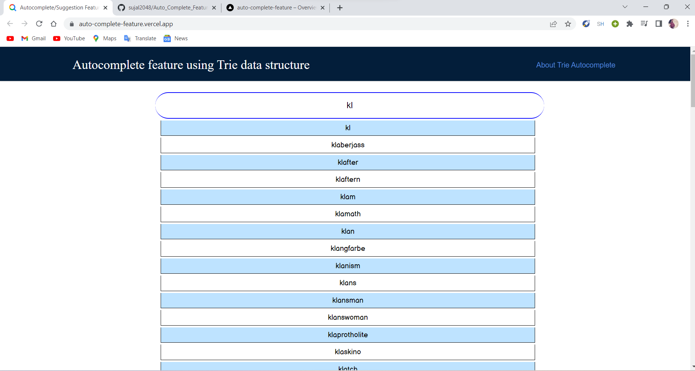

# Auto_Complete_Feature
This projects implements the Trie Data Structure which develops an autocomplete feature or suggestion.

## Table of contents

- [Overview](#overview)
  - [The challenge](#the-challenge)
  - [Screenshot](#screenshot)
  - [What I learned](#what-i-learned)
- [Author](#author)

## Overview

- Live Demo:👇

- [x] [auto-complete-feature.vercel.app/](https://auto-complete-feature.vercel.app/)

### The challenge

Users should be able to:

- Enter a word or partial word
- Recieve a list of words whose names start with the substring that they enter in the search bar

### Screenshot

### What I learned

I learned about the Trie data structure and how it works and it's application. 

## Author

- [SUJAL GUPTA](https://github.com/sujal2048)
